:toc: macro
:toclevels: 4
:numbered:

= paRt Manual
Fleeesch
v1.0.2

toc::[]

== Introduction

parRt is a custom Reaper theme consisting of multiple theme files and a Theem Adjuster script.

The theme itself comes with 3 theme files that are absolutely identical in function, but differ in their assets and colors. Reaper's theming system relies heavily on pre-rendered bitmaps, in order to implement a wider variety of colors each theme has their own individual set of assets.

The theme adjuster is a Lua script that incorporates several other ressources (bitmaps, lua files, text files, ...) in order to properly function. There's an additional mandatory script used for programatically restarting the theme adjuster. This is required in order to properly handle color theme changes that happen outside the theme adjuster.

== Installation

=== Using ReaPack

Import the repository into your ReaPack instance using the following link within ReaPack's repository manager:

`https://raw.githubusercontent.com/Fleeesch/ReaPack-Fleeesch/master/index.xml`

Search for "paRt" using ReaPack's search function and install it. The install might take a while because of the large filesize of the theme files and the relatively high file count of the Theme Adjuster. The Scripts required for the Theme should be automatically added to your Action List.

=== Installing paRt manually

Download the `part_manual_install\*.zip` from the release section of this resporitory and extract the contents into your Reaper ressource folder.

If you want to locate your Reaper ressource folder, look for the action `Options > Show REAPER resource path in explorer/finder...` located in the top menu of Reaper.

[WARNING]
====
You must keep the folder structure intact. Any changes in the folder structure will likeley result in malfunction of the Theme Adjuster.
====

Import ***.lua** scripts within `Scripts/Fleeesch/Themes/paRt` into the Reaper action list. You can open Reaper's action list using the `Actions > Show action list...` command located in the top menu.

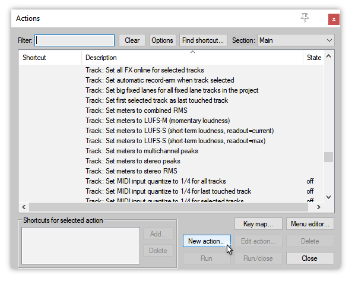

Then look at for the `New action button` and use its `Load Rescript...` action in order to load the LUA files.

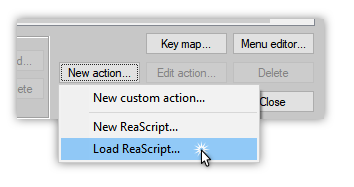

Look for the scripts within your Reaper Ressource folder. You can select all the files at once per import.

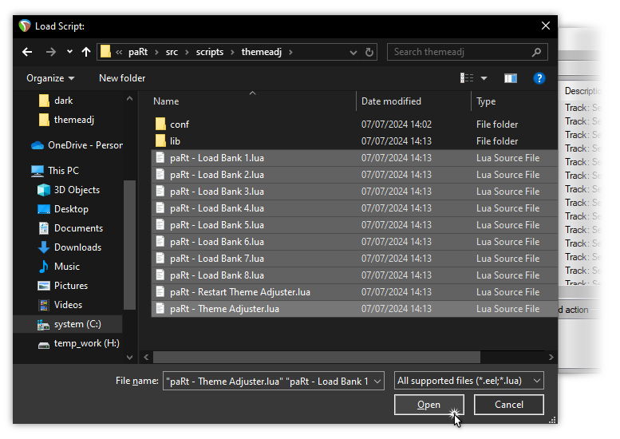

Check if the scripts have been loaded successfully by typing "paRt" in the `Filter` box.

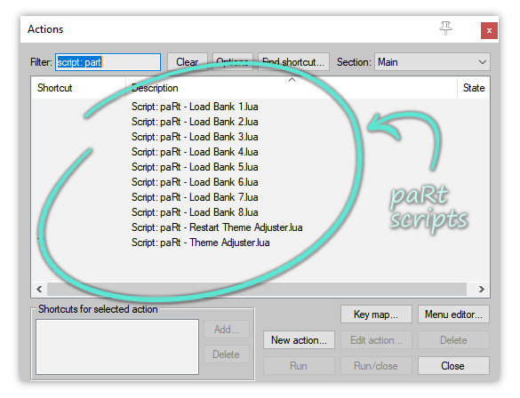

== Theme Files

The various theme files that come with paRt provide different assets and colors. *While their functionality is identical, Reaper itself treads them as individual themes, storing their parameter settings individually.* The moment you launch the paRt Theme Adjuster those settings are overwritten by a settings file the Theme Adjuster stores separately from Reaper's settings.

If you want to switch between different paRt Theme files it is highly recommended to use the Theme Adjuster that provides this functionality.

== Theme Adjuster

Launch the Theme Adjuster running the Action List using the `paRt - Theme Adjuster.lua` script or the shortcut at the rightmost position in the transport bar of Reaper. PaRt shortcuts in the transport can be disabled, so use the action list as an alternative.

Most of the elements of the Theme Adjuster are supossed to be self-explaining, but there's also no risk in playing around with the faders and buttons.

=== Hints

Some settings are very specific and require further explanation. There's a hint system built into the Theme Adjuster that shows tooltip messages when you hover various elements. The current bank can be changed using the Theme Adjusters bottom bank bar, optional bank buttons shown in the transport panel or by launching the provided Lua scripts.

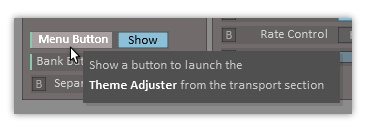

All table header symbols provide hints, for every other element there's a marker placed in the label to signal an available hint.

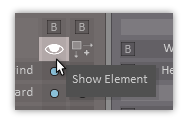
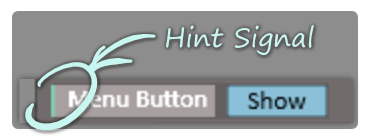

=== Bank System

PaRt provides a bank system that allows you to switch between different Theme Adjuster settings on the fly.

The paRt Theme Adjuster stores individual bank parameter values in a separate file and overwrites Reaper's current theme parameters everytime a paRt action is triggered or when the Theme Adjuster is active.

==== Usage

You can selectively activate the usage of banks for each parameter that paRt provides. Parameters that don't use the bank system don't react to bank changes.

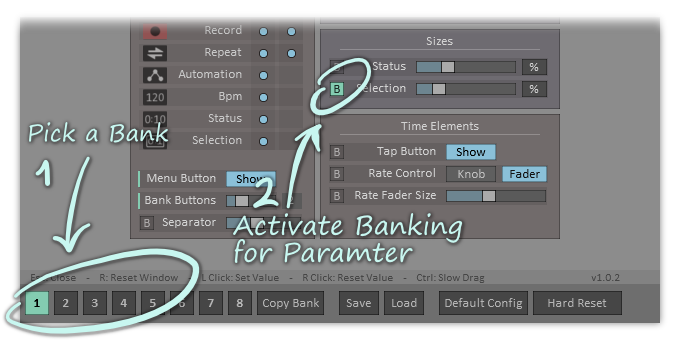
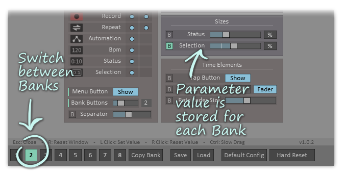

==== Copying Banks

You can copy parameter settings from the currently activated bank to other banks. In order to do this select the bank you want to copy and activate the copy mode by clicking the `[Copy Bank]` button in the bank bar.

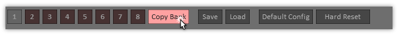

The source bank button is now disabled. You can toggle the target banks by pressing the individual bank buttons.

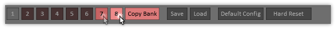

Press the `[Copy Bank]` button once again. The settings of the source banks are now being copied to the target banks.

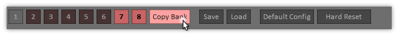

The Theme Adjuster shows an info messages to inform you about the successfull copy process.

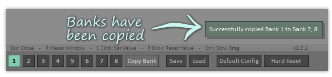

==== Save and Load Settings

You can save and load settings using the buttons provided in the bottom bar of the Theme Adjuster interface. All parameters (including all individual bank parmeter settings) are stored in a single file.

The `*.partmap` extension is used to prevent accidental overwriting. The content of the file ist just a human-readable Lua table.

[IMPORTANT]
====
Saving and Loading requires the `Rejs_ReaScriptAPI` extension to be installed in Reaper. Without this extension the buttons will be hidden.
====

=== Load Default Configuration

Activating the `[Default Config]` button in the bottom bar will load the `defaults.partmap` file in the Theme Adjuster configuration directory. It is just a normal settings file created as a demonstration of the themes core features.

[IMPORTANT]
====
It is technically possbible to overwrite the `defauls.partmap` file, but not recommended. Updates might happen to overwrite the file.
====

=== Hard Reset Parameters

Reaper Theme parameters come with a hard-coded default value. Activating the `[Hard Reset]` will reset each parameters to its default value. This action also clears all bank-related settings.

Use this feature if you want to start fresh with your own configuration.

== Reaper Layouts

Reaper provides via the `Screensets/Layouts` an option to implement different layouts for its elements that can be individually set for different tracks. This feature is used for provding assets and layouts in multiple sizes to allow compatibility with displays that have a high pixel density.

[IMPORTANT]
====
It is better to leave Reaper's `Layouts` section  alone in order to not mess up Multi-DPI support of the theme.
====

== Modifying paRt

Since paRt is essentially just a collection of Reaper themes, it can be modified without any restrictions.

=== Quick Guide

1. Go to the ColorThemes folder of your Reaper instance
2. Extract the paRt _ReaperThemeZip_ files
3. *Optional:* Rename the paRt _ReaperThemeZip_ files into something unusuable (for example `nameOfTheThemefile.ReaperThemeZip.skip`)
4. Modify the extracted theme files

=== Detailed Guide

1. Locate the theme files in the _ColorThemes_ folder of your Reaper instance. If you don't know where your _ColorThemes_ folder is located, look at the top men for the action `Options > Show REAPER ressource path in explorer/finder`. It will open the folder for you.
2. paRt provides its themes via a _ReaperThemeZip_ file per theme. A _ReaperThemeZip_ file is just a zip file under a different name, you can tread it like any average zip archive. Each _ReaperThemeZip_ of paRt should have a _ReaperTheme_ file (named something like part_dark_unpacked.ReaperTheme) and a folder containing its data. Extract the contents of the theme file you want to modify in the ColorThemes folder.
3. The extraced theme can be loaded like any other theme. You can now replace and delete images, tweak the colors using Reaper's integrated theme tweaker and modify the WALTER layout of the _rtconfig.txt_ (placed in the extracted theme folder).
4. Rename the original ReaperThemeZip file into something like `nameOfTheThemefile.ReaperThemeZip.skip` in order to force Reaper and the paRt Theme Adjuster to ignore the original files.

[discrete]
==== Important

- *Renaming or deleting the original files is optional, but recommended*
- The Theme adjuster is looking for name patterns to identify the paRt theme files. Renaming the original ones by changing their extension will trick the Theme Adjuster and Reaper into ignoring those files.
- Any ReaPack update of paRt will overwrite existing _ReaperThemeZip_ files, or create them if they don't exist. Meaning you'd have to eventually delete or rename them manually with each update.
- Your modified files will not receive any updates

[discrete]
==== Notes

Some good-to-know facts about theming:

- The theme itself won't refresh automatically, you have to select another theme and then reselect the one you're working on right now. This can be easily automated by creating a _Custom Action_ in Reaper that switched to the next and the to the previous theme in one action.
- Most of the assets are provided in for several zoom levels, found in their respective subfolders (125 = 1.25 zoom factor,...). There are lots of exceptions that don't use dpi-specific assets are only available once. An example would be the item backgrounds (item_bg.png, item_bg_sel.png).
