= paRt - User Guide
:toc:
:toclevels: 100
:sectnums:
:sectnumlevels: 100
:gitrelease: https://www.google.de

== About

=== Summary

paRt is a theme for Reaper intended to be used as a universal solution accross multiple generations of displays. It is compatible with oldschool 4:3 panels, tiny 16:9 laptop panels as well as 4K panels. 

=== Overview of Features

Zoom levels::

* 100%, 125%, 150%, 175%, 200%, 225%, 250%, 300%
* One theme file containing all assets
* optional separate theme files containing assets for only one specific zoom level

Skins::

* Dark
* Dark with alternative Colors for Windows compatibility
* Light

Customizability::

* Adjustable MCP

* MCP Fader design:
** All-Faders Mode (Volume, Pan and Width as vertical Faders)
** Horizontal

Scripts::

* Store and recall up to 8 different Theme Adjuster settings.

=== Versions

Each skin of paRt is a separate package containing a full set of theme assets. There are different versions of paRt mainly for more specific use cases.

==== Default version / Full Version

Contains 8 assets required for covering their respective zoom level. The theme works on multiple displays with different DPI settings, *but has some scaling issues with certain zoom levels that aren't 100%, 150% or 200%.*

==== Single Size Version

For each skin you can download separate theme files that contain only one asset of a certain zoom level. There are certain quirks that come with a multi-dpi themes that are difficult to fix, so if any bugs occur at your desired DPI level you might want to try one of the split theme files.

*Also, the size of the themes is drastically reduced, resulting in much faster loading times for Reaper.*

=== Skins / Colors

There are 3 skins available:

==== Dark

Default skin.

==== Dark - Windows

A variation of the Dark skin that compensates for Windows lack of Dark Mode support for Win32 Apps (that includes Reaper). The floating windows that allow theming come with a light background and their interactive elements are mostly in a lighter shade.

==== Light

Light skin for those who prefer to work in a brighter environment.

== Installation

=== Using ReaPack

If you want to get paRt by using Reapers unofficial package manager add this url to your repository list:

https://www.google.de

Reapack will download the most recent ReaperThemeZip files of all skins. The theme variation

=== Manually downloaded Github-Release

You can download each version of paRt individually {gitrelease}[from the Github-repository release page].

Unpack the archive and move the included *.ReaperThemeZip file to the ColorThemes folder of your Reaper installation.

The location of the ColorThemes folder varies depending on your Operating System. If you want to know where it is, open Reaper and unter the top menu register 'Options' you will find the option to 'Show REAPER ressource path in explorer/finder'.

On a portable install of Reaper the ColorThemes folder will be located in the program folder of Reaper.

=== Fonts

paRt uses the Carlito font, an opensource font under the GNU license. The font is included in every release of paRt and needs to be installed for optimal compatibility. You can use standard fonts, it just will look weird because the sizing will be slightly off.

The installation of the font varies depending on the Operating System you use.

Windows::
Right click the .tff file and choose 'Install Font'.
MacOS::
Double-click on the .tff in finder and click Install in the font preview that opens.
Linux::
Double-click on the .tff file and open the font viewer. There should be an Install button in the top right corner. Click that one. Optionally compile a new kernel.

=== Scripts

Scripts are automatically installed and integrated when downloading paRt using Reapack. If you manually install the scripts from a GitHub release page, integrate them like any other script in Reaper. *Keep the folder structure intact, the scripts depent on a library file.*

== Configuration

=== Theme Adjustments

Custom settings for the theme are entirely done using the official Reaper Theme Adjuster. This is an implementation that happened on purpose to ensure maximum compatibility with a default Reaper installation.

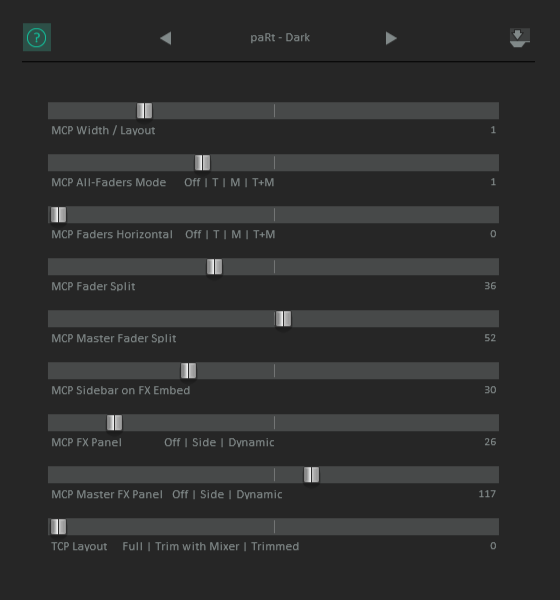

==== MCP Width / Layout

//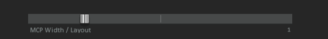

Changes the layout of the MCP. The layouts are arranged by width, so the first layout is a thin meter strip while the last layout gives you the largest meter. All tracks share the same layout all the time.

[%autowidth,frame=none, grid=none]
|===
|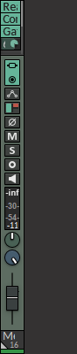 |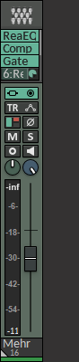 |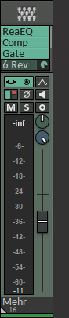 |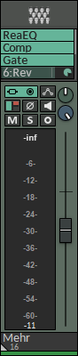
|===

==== MCP All-Faders Mode

//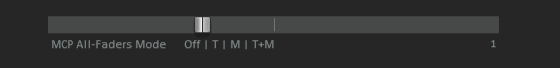

Alternates between the conventional volume fader and pan knob configuration and an all-vertical-faders layout. The all-fader layout is helpful if you're working with control surfaces and prefer to use the motorized faders exclusively. That way you don't have to translate the linear motion of a motorized fader to pan knob and vice versa.

Depending on the value you can have this layout set exclusively for the Master MCP track or just the ordinary tracks.

[%autowidth,frame=none, grid=all]
|===
|Value |Layout |

|0 |Conventional fader / knob combination layout for all tracks |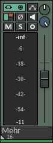
|1,2,3 |All-Faders layout for... +
*1 -* ordinary tracks +
*2 -* master track +
*3 -* all tracks |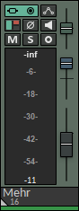
|===

==== MCP Faders Horizontal

//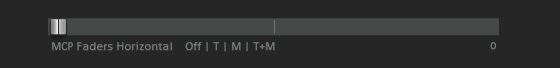

This arranges the pan/width faders in a horizontal way. The setting gets only applied for tracks that have the All-Faders layout applied to them. The first MCP layout (channel strip) ignores this setting since there's just not enough space available.

[%autowidth,frame=none, grid=all]
|===
|Value |Layout |

|0 |Horizontal layout is not applied |
|1,2,3 |Horizontal layout for... +
*1 -* ordinary tracks +
*2 -* master track +
*3 -* all tracks |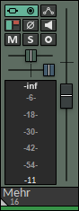
|===

==== MCP Fader Split / MCP Master Fader Split

//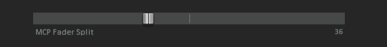
//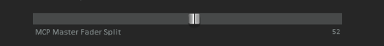

This setting is only used when an All-Faders layout is applied without the horizontal layout.

Use this setting to change the amount of space for the volume fader, the higher the value the less space the volume fader gets. The space is calculated dynamically. The Master track has its separate adjustment.

[NOTE]
Be aware that the faders are converted to knobs if there's not enough space.

[%autowidth,frame=none, grid=none]
|===
|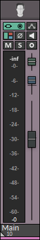 |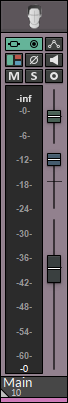 |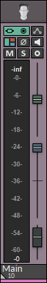
|===

==== MCP Sidebar on FX Embed

//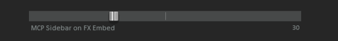

Dynamically creates a sidebar layout for the MCP tracks if there is an embedded FX available on the track.

The Master track is excluded from this setting since there are some issues with dynamically resizing the Master MCP track that couldn't be resolved.

[NOTE]
If a track already uses a sidebar layout this setting is going to overwrite the sidebar width, unless the width in this setting is set to be less.

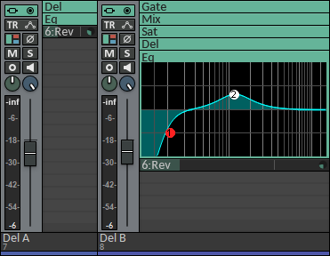

==== MCP FX Panel / MCP Master FX Panel

//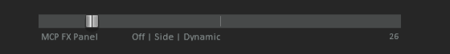
//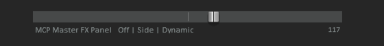

Changes the size, positioning and behaviour of the MCP FX Panel. The Master track is excluded from this setting

[cols="1,1,2,3", frame=none, grid=all]
|===
4+|Value

|0 |1 - 99 |100-199 |200
|No FX Panel |Fixed height FX Panel. The height is dynamically calculated and depends on the mixer height. |FX Panel as sidebar with fixed width.
 |Normal FX Panel that can be dynamically resized per track using drag-and-drop.
|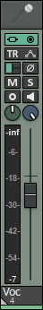 |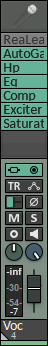 |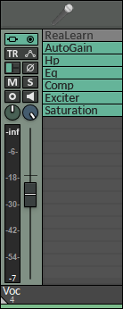 |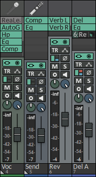
|===

==== TCP Layout

//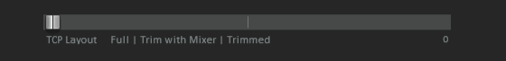

Adjustment for trimming the layout of the TCP. This is useful if you work with a static setup where the mixer is always visible and you want to maximize the arrangement-area.

[%autowidth,frame=none, grid=all]
|===
|Value |Layout |

|0 |Show all elements of the TCP tracks all the time. |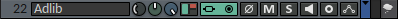
|1,2
|Hide most of the TCP elements... +
*1 -* if the mixer is visible +
*2 -* all the time
|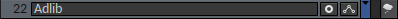
|===
